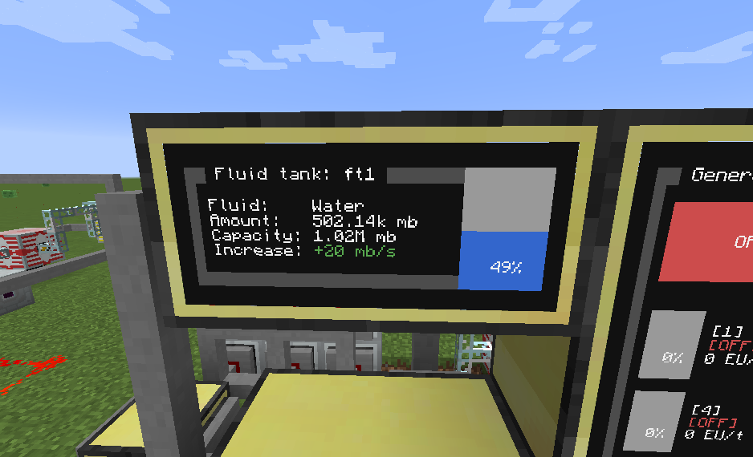
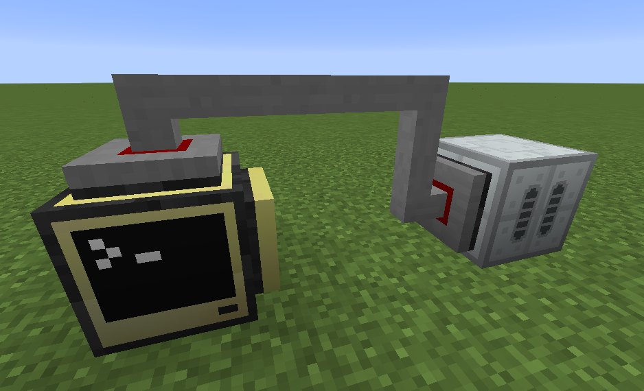

# Fluid tank

Automatic program for display tank capacity and current content.





## Requirements

1. IndustrialCraft 2 (IC2)
2. Computercraft (CC:Tweaked)

Tested on Minecraft 1.12.2

## Installation

1. Install package `fluidTank`
2. Run `mv fluid-tank-config.json config.json` to move config
3. Run `edit config.json` and save your current configuration
4. Restart computer (`ctrl + R`)

## Configuration

- All configurations are **required**.
- `remoteMonitor` is name for [remote monitor](https://github.com/mesour/packager-server/blob/master/docs/en/monitor.md)
- `tank` is name of connected peripheral

```
{
  "name": "ft1",
  "rednet": "left",
  "remoteMonitor": "m1",
  "tank": "ic2:iridium_tank_1"
}
```
