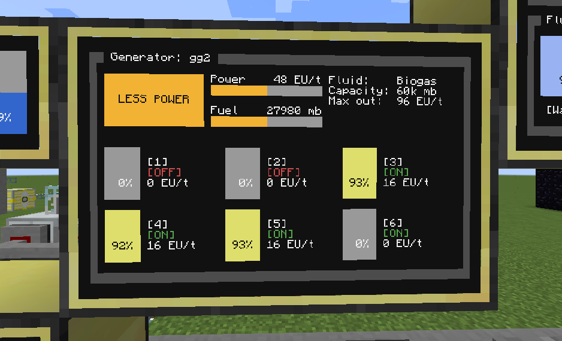
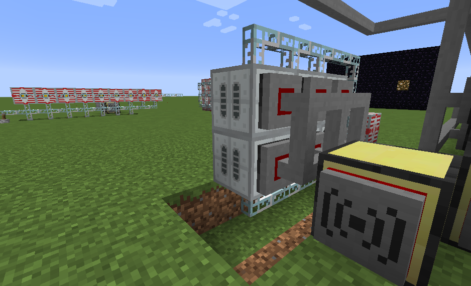

# Generator grid

Automatic program for display data from Geothermal or SemiFluid generator.





## Requirements

1. IndustrialCraft 2 (IC2)
2. Computercraft (CC:Tweaked)

Tested on Minecraft 1.12.2

## Installation

1. Install package `generatorGrid`
2. Run `mv generator-grid-config.json config.json` to move config
3. Run `edit config.json` and save your current configuration
4. Restart computer (`ctrl + R`)

## Configuration

- All configurations are **required**.
- `remoteMonitor` is name for [remote monitor](https://github.com/mesour/packager-server/blob/master/docs/en/monitor.md)
- `fuel` can be `minecraft:lava` or `minecraft:ic2biogas`
- `monitorSize` must be array with two items [`width`, `height`].
  - `width` can be `big` or `medium`
  - `height` can be `big`, `medium` or `small`
- `generators` is array of connected peripherals

```
{
  "name": "gg1",
  "rednet": "right",
  "remoteMonitor": "m1",
  "fuel": "minecraft:lava",
  "monitorSize": ["medium", "small"],
  "generators": [
    "ic2:geo_generator_0",
    "ic2:geo_generator_1",
    "ic2:geo_generator_2",
    ...
  ]
}
```
