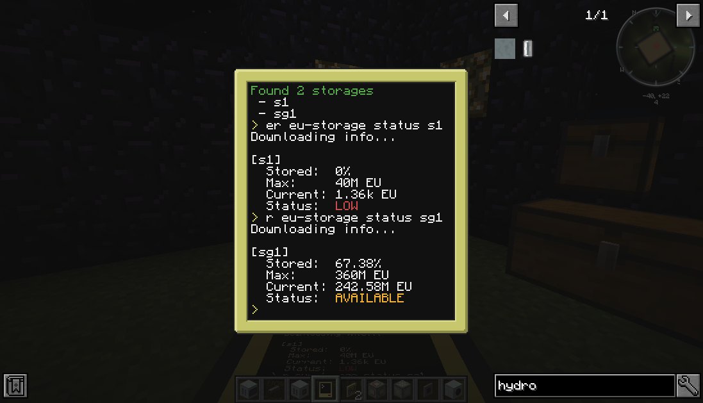

# Manager

Program for remote managing and display info.

- **Wireless modem must be attached on computer.**



## Requirements

1. Computercraft (CC:Tweaked)

Tested on Minecraft 1.16.5

## Installation

1. Install package `manager`

## Help

Next command can be used for show allowed plugins:
```
manager help
```

Example result:
```
Usage:
 manager help [mode]
 manager <mode> <command>

Allowed modes:
 - eu-storage
 - reactor
```

Next command can be used for show allowed commands for plugin `reactor`:
```
manager help reactor
```

Example result:
```
Usage:
 manager reactor <command>

Available commands:
 - list
 - status <reactor>
```

## Plugin `turtle`

Next command can be used for show available reactor names:
```
manager turtle list
```

Example result:
```
Searching turtles...

...............
Found 1 turtles
 - t1
```

### Setup turtle for new digging location

Next command will provide you with setup turtle (start, end, storages location, etc.)

Run following command and read instructions:
```
manager turtle setup t1
```

### Listening turtle for current state and position

Next command can be used for show turtle information
```
manager turtle listen t1
```

## Plugin `reactor`

Next command can be used for show available reactor names:
```
manager reactor list
```

Example result:
```
Searching reactors...

...............
Found 1 reactors
 - r1
```

### Reactor detail information

Next command can be used for show reactor detail information:
```
manager reactor status r1
```

Example result:
```
Downloading info...

[r1] (LESS POWER)
  Heat: 0/10000 - 0%
  Power: 83%
  Type: EU
  Fuel: 55.31%
```

## Plugin `eu-storage`

Next command can be used for show available EU storage names:
```
manager eu-storage list
```

Example result:
```
Searching storages...

...............
Found 2 storages
 - s1
 - sg1
```

### Reactor detail information

Next command can be used for show EU storage detail information:
```
manager eu-storage status s1
```

Example result:
```
Downloading info...

[s1]
  Stored: 10%
  Max: 40M EU
  Current: 10M EU
  Fuel: LOW
```
