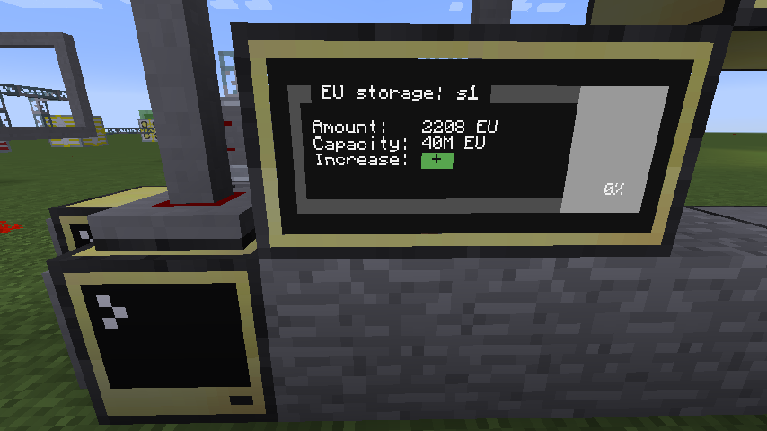

# Remote monitor

Input for monitor is via Wireless. It is used for many programs output.



## Requirements

1. Computercraft (CC:Tweaked)

Tested on Minecraft 1.12.2

## Installation

1. Install package `monitor`
2. Run `mv monitor-config.json config.json` to move config
3. Run `edit config.json` and save your current configuration
4. Restart computer (`ctrl + R`)

## Configuration

- All configurations are **required**.
- `monitors` is array of remote monitors. In example is `r1` name of reactor
and `monitor_1` is name for connected peripheral monitor that is used for display
data from reactor `r1`. Reactor must have `m1` in `remoteMonitor` configuration option.

```
{
  "name": "m1",
  "rednet": "right",
  "monitors": {
    "r1": "monitor_1"
  }
}

```
