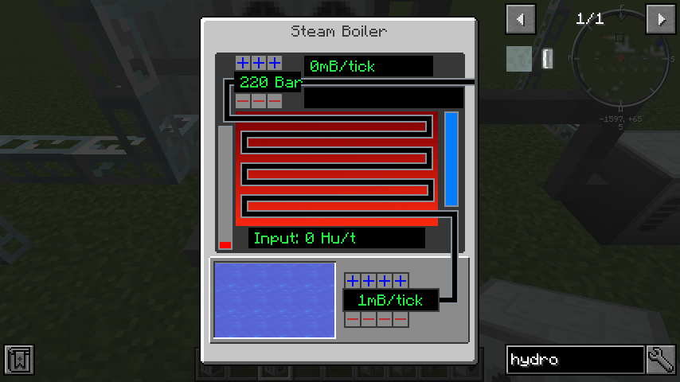

# Turbine

Automatic program for use HeatExchanger to generate energy.




## How to build

1. floor is `Steam boiler` and behind it is `Liquid Heat Exchanger`
2. floor is `Kinetic generator` and `Steam turbine`
3. floor is `Kinetic generator` and `Steam turbine`
4. floor is `Condenser`

- Configuration for `Steam boiler` is on last image
- Steam turbines and Condenser has attached `Pump attachment` to collect water and push it to boiler
- Only `Kinetic generators`, `Liquid heat exchanger` and `Steam boiler` are connected to network
- Recommended is use **distilled water** to prevent calcification.
- Recommended is use `Heat vents` in Condenser

## Requirements

1. IndustrialCraft 2 (IC2)
2. Computercraft (CC:Tweaked)

Tested on Minecraft 1.12.2

## Installation

1. Install package `electroMeter`
2. Run `mv turbine-config.json config.json` to move config
3. Run `edit config.json` and save your current configuration
4. Restart computer (`ctrl + R`)

## Configuration

- All configurations are **required**.
- `remoteMonitor` is name for [remote monitor](https://github.com/mesour/packager-server/blob/master/docs/en/monitor.md)
- `generator1` is name of a connected first Kinetic generator (IC2 mod)
- `generator2` is name of a connected second Kinetic generator (IC2 mod)
- `heatExchanger` is name of a connected HeatExchanger (IC2 mod)
- `steamGenerator` is name of a connected SteamGenerator (IC2 mod)

```
{
  "name": "lg1",
  "rednet": "left",
  "remoteMonitor": "m2",
  "generator1": "ic2:kinetic_generator_2",
  "generator2": "ic2:kinetic_generator_3",
  "heatExchanger": "ic2:liquid_heat_exchanger_0",
  "steamGenerator": "ic2:steam_generator_1",
}
```
