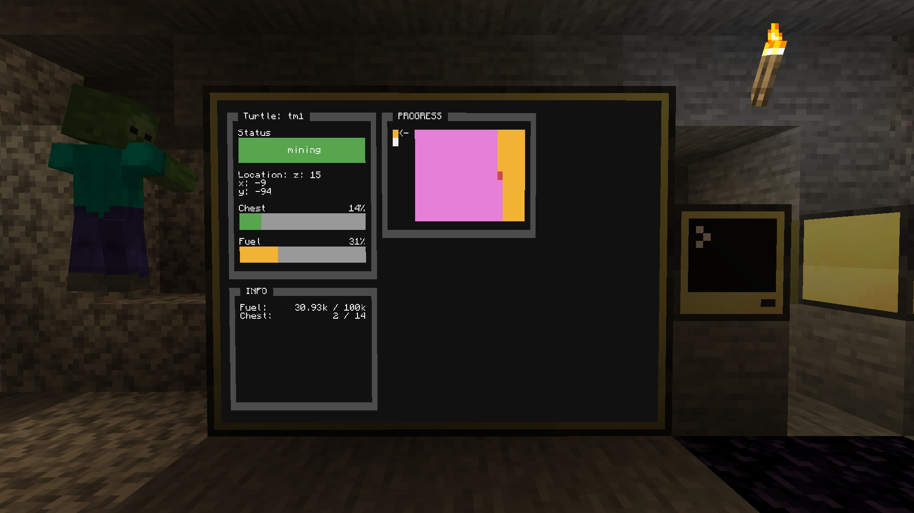

# TurtleMonitor

This allows you see what your turtles doing



## Requirements

1. Computercraft (CC:Tweaked)
2. Need created [packager server](https://github.com/mesour/packager-server#server-installation) in game in game

Tested on Minecraft 1.16.5

## Installation

1. Install package `turtleMonitor`
2. Run `mv turtle-monitor-config.json config.json` to move config
3. Run `edit config.json` and save your current configuration
4. Restart turtle (`ctrl + R`)

## Configuration

- All configurations are **required**.

```
{
  "name": "tm1",
  "rednet": "right",
  "remoteMonitor": "m1",
  "turtleName": "t1"
}
```
