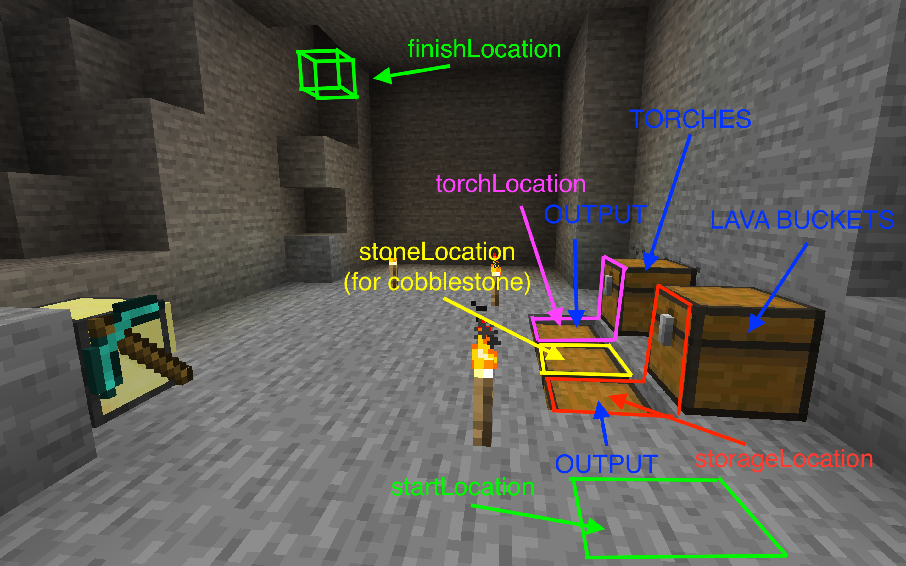

# Packager server for Minecraft

## Requirements

- `Computercraft (CC:Tweaked)`
- (optional) `IndustrialCraft 2 (IC2)` or `Plethora` for some packages if you want it

Tested on Minecraft 1.16.5 and 1.12.2

## Features

- It allow you to install packager server
- Scripts on server can be updated online from Github repository (this or your own)
- **Everything can be managed by simple using commands and edit configuration files**
- Server is running in game and other computers with wireless connection can connect and download package that needed
- After download you only configure it and hold `ctrl + R`. It is everything :D
- This repository contains server with more packages for monitor and control IndustrialCraft machines _(for now)_

Example monitor (for mining turtle fluid reactor):



## Contributing
Any contribution is welcome, be that using the mod, reporting bugs or contributing code.

- If you create Pull request, before it run: `./bin/build.sh` and commit changes.
- Bug reporting: [here](https://github.com/mesour/packager-server/issues)

### Donate

If you contribute to the development, we will be more motivated to develop
new features and improve existing features.

[](https://www.paypal.com/cgi-bin/webscr?cmd=_s-xclick&hosted_button_id=GSDRZW9YGPE5G&source=url)

## Usable packages

- `electroMeter` - [usage](https://github.com/mesour/packager-server/blob/master/docs/en/energyMeter.md)
- `energyStorage`
- `energyStorageGrid` - [usage](https://github.com/mesour/packager-server/blob/master/docs/en/energyStorageGrid.md)
- `fluidTank` - [usage](https://github.com/mesour/packager-server/blob/master/docs/en/fluidTank.md)
- `generatorGrid` - [usage](https://github.com/mesour/packager-server/blob/master/docs/en/generatorGrid.md)
- `manager` - [usage](https://github.com/mesour/packager-server/blob/master/docs/en/manager.md)
- `monitor` - [usage](https://github.com/mesour/packager-server/blob/master/docs/en/monitor.md)
- `nuclearReactor` - [usage](https://github.com/mesour/packager-server/blob/master/docs/en/reactor.md)
- `reactorMonitor` - [usage](https://github.com/mesour/packager-server/blob/master/docs/en/reactorMonitor.md)
- `turbine` - [usage](https://github.com/mesour/packager-server/blob/master/docs/en/turbine.md)
- `Automatic mining turtle` - [usage](https://github.com/mesour/packager-server/blob/master/docs/en/turtle.md)

## Client installation

```
wget https://raw.githubusercontent.com/mesour/packager-server/master/generated/packager.lua
```

## Usage

Init `packager.json` file, for example for package`reactorMonitor`.
It will create configuration file `packager.json` with required package.
```
packager init reactorMonitor
```

For download latest file for your project from packager server run this command:
```
packager
```

For upgrade to the latest version use this command:
```
packager self-upgrade
```

### Client configuration

In this example is required `monitor` package.

```
{
  "required": {
    "monitor": "*"
  }
}
```

## Server installation

Download latest installer with:

```
wget https://raw.githubusercontent.com/mesour/packager-server/master/generated/packager-installer.lua
```

For upgrade to the latest version use this command:
```
packager-installer self-upgrade
```

Replace `<REPOSITORY>` to your `user/repository` from you Github URL and run _(for update use same command.)_:

```
packager-installer <REPOSITORY>
```

Example with `mesour/packager-server` repository:

```
packager-installer mesour/packager-server
```